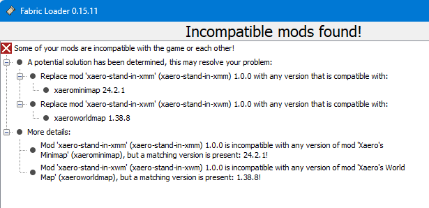

# Xaero Stand-In Mods

A pair of Minecraft mods that act as stand-ins, allowing clients to connect to servers running Xaero's World Map and/or Xaero's Mini Map without having to have those mods installed themselves.

Intended for players who do not wish to use those mods and/or wish to use a different mapping mod instead.

These stand-in mods are deliberately marked as "breaking" against the real Xaero mods. Attempting to load them together will result in a Fabric error message similar to this...

